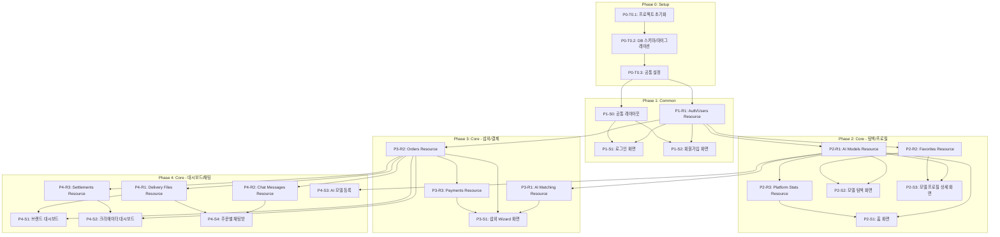

# TASKS.md - AI Model Marketplace

> Domain-Guarded 태스크 구조 v2.0
> "화면이 주도하되, 도메인이 방어한다"

---

## Interface Contract Validation

```
✅ Interface Contract Validation PASSED

Coverage Matrix

Resource        │ Fields  │ Screens Using
────────────────┼─────────┼──────────────────────────────
users           │ 7/7 ✅  │ login, signup
ai_models       │ 15/15 ✅│ home, explore, model-profile, booking-wizard, creator-dashboard, model-registration
model_images    │ 4/4 ✅  │ model-registration
favorites       │ 2/2 ✅  │ explore, model-profile, brand-dashboard
orders          │ 11/11 ✅│ booking-wizard, brand-dashboard, creator-dashboard, order-chat
ai_matching     │ 4/4 ✅  │ booking-wizard
payments        │ 6/6 ✅  │ booking-wizard
delivery_files  │ 5/5 ✅  │ brand-dashboard, order-chat
chat_messages   │ 6/6 ✅  │ order-chat
settlements     │ 6/6 ✅  │ creator-dashboard
platform_stats  │ 3/3 ✅  │ home

Total: 11 resources, 10 screens, 91 fields, 100% coverage
```

---

## 의존성 그래프



---

## Phase 0: 프로젝트 셋업

### [x] P0-T0.1: 프로젝트 초기화
- **담당**: frontend-specialist
- **스펙**: Next.js + FastAPI 모노레포 구조 생성
- **파일**:
  - `frontend/` - Next.js 14+ (App Router)
  - `backend/` - FastAPI (Python 3.11+)
  - `docker-compose.yml` - PostgreSQL, Redis
  - `.env.example`
- **완료 조건**:
  - [ ] `npm run dev` (frontend) 정상 실행
  - [ ] `uvicorn main:app` (backend) 정상 실행
  - [ ] Docker Compose로 PostgreSQL 연결

### [x] P0-T0.2: DB 스키마 및 마이그레이션
- **담당**: database-specialist
- **스펙**: `docs/planning/04-database-design.md` 기반 Alembic 마이그레이션
- **파일**: `backend/alembic/` → `backend/app/models/`
- **TDD**: RED → GREEN → REFACTOR
- **테이블**: USER, AUTH_TOKEN, AI_MODEL, MODEL_IMAGE, MODEL_TAG, FAVORITE, ORDER, PAYMENT, DELIVERY_FILE, CHAT_MESSAGE, SETTLEMENT
- **의존**: P0-T0.1
- **완료 조건**:
  - [ ] `alembic upgrade head` 성공
  - [ ] 모든 테이블 생성 확인

### [x] P0-T0.3: 공통 설정 및 미들웨어
- **담당**: backend-specialist
- **스펙**: CORS, 에러 핸들링, 로깅, 환경변수 설정
- **파일**: `tests/test_config.py` → `backend/app/core/config.py`, `backend/app/core/middleware.py`
- **TDD**: RED → GREEN → REFACTOR
- **의존**: P0-T0.2
- **완료 조건**:
  - [ ] CORS 설정 동작
  - [ ] 에러 응답 형식 통일

---

## Phase 1: 공통 (인증 + 레이아웃)

### P1-R1: Auth/Users Resource

#### [ ] P1-R1-T1: Auth/Users API 구현
- **담당**: backend-specialist
- **리소스**: users
- **엔드포인트**:
  - POST /api/auth/signup (회원가입)
  - POST /api/auth/login (로그인)
  - POST /api/auth/logout (로그아웃)
  - GET /api/users/me (내 정보)
  - PATCH /api/users/me (정보 수정)
  - POST /api/auth/social/google (Google OAuth)
  - POST /api/auth/social/kakao (Kakao OAuth)
- **필드**: id, email, nickname, role, profile_image, company_name, created_at
- **파일**: `backend/tests/api/test_auth.py` → `backend/app/routes/auth.py`
- **스펙**: JWT 기반 인증, 소셜 로그인 (Google, Kakao), 역할 기반 접근 제어
- **Worktree**: `worktree/phase-1-auth`
- **TDD**: RED → GREEN → REFACTOR
- **의존**: P0-T0.3

---

### P1-S0: 공통 레이아웃

#### [ ] P1-S0-T1: 공통 레이아웃 구현
- **담당**: frontend-specialist
- **컴포넌트**:
  - Header (로고, 네비게이션, 사용자 메뉴)
  - Footer (회사 정보, 이용약관)
  - LoginModal (비로그인 시 인증 필요 액션용)
  - Toast (알림)
  - EmptyState (빈 상태)
  - StatusBadge (주문 상태 배지)
- **파일**: `frontend/tests/components/Layout.test.tsx` → `frontend/src/components/layout/`
- **스펙**: `specs/shared/components.yaml`, `docs/planning/05-design-system.md` 참조
- **Worktree**: `worktree/phase-1-layout`
- **TDD**: RED → GREEN → REFACTOR
- **데모**: `/demo/phase-1/s0-layout`
- **데모 상태**: guest, brand-user, creator-user
- **의존**: P0-T0.1

---

### P1-S1: 로그인 화면

#### [ ] P1-S1-T1: 로그인 UI 구현
- **담당**: frontend-specialist
- **화면**: /auth/login
- **컴포넌트**: LoginForm (이메일/비밀번호, 소셜 로그인 버튼)
- **데이터 요구**: users (data_requirements 참조)
- **파일**: `frontend/tests/pages/Login.test.tsx` → `frontend/src/app/auth/login/page.tsx`
- **스펙**: `specs/screens/login.yaml` 참조
- **Worktree**: `worktree/phase-1-auth`
- **TDD**: RED → GREEN → REFACTOR
- **데모**: `/demo/phase-1/s1-login`
- **데모 상태**: default, error, loading
- **의존**: P1-R1-T1, P1-S0-T1

#### [ ] P1-S1-T2: 로그인 통합 테스트
- **담당**: test-specialist
- **화면**: /auth/login
- **시나리오**:
  | 이름 | When | Then |
  |------|------|------|
  | 이메일 로그인 성공 | 유효한 이메일/비밀번호 | 역할별 대시보드로 이동 |
  | 로그인 실패 | 잘못된 비밀번호 | 에러 메시지 표시 |
  | 소셜 로그인 (신규) | Google 최초 로그인 | /auth/signup으로 이동 |
  | 회원가입 이동 | 링크 클릭 | /auth/signup으로 이동 |
- **파일**: `frontend/tests/e2e/login.spec.ts`
- **Worktree**: `worktree/phase-1-auth`
- **의존**: P1-S1-T1

#### [ ] P1-S1-V: 연결점 검증
- **담당**: test-specialist
- **화면**: /auth/login
- **검증 항목**:
  - [ ] Endpoint: POST /api/auth/login 응답 정상
  - [ ] Endpoint: POST /api/auth/social/google 응답 정상
  - [ ] Navigation: 로그인 성공 → /dashboard/brand 또는 /dashboard/creator
  - [ ] Navigation: 회원가입 링크 → /auth/signup 라우트 존재
  - [ ] Auth: JWT 토큰 저장/갱신 동작
- **파일**: `frontend/tests/integration/login.verify.ts`
- **의존**: P1-S1-T2

---

### P1-S2: 회원가입 화면

#### [ ] P1-S2-T1: 회원가입 UI 구현
- **담당**: frontend-specialist
- **화면**: /auth/signup
- **컴포넌트**: SignupForm (역할 선택, 이메일, 비밀번호, 닉네임, 회사명)
- **데이터 요구**: users (data_requirements 참조)
- **파일**: `frontend/tests/pages/Signup.test.tsx` → `frontend/src/app/auth/signup/page.tsx`
- **스펙**: `specs/screens/signup.yaml` 참조
- **Worktree**: `worktree/phase-1-auth`
- **TDD**: RED → GREEN → REFACTOR
- **데모**: `/demo/phase-1/s2-signup`
- **데모 상태**: brand-role, creator-role, validation-error
- **의존**: P1-R1-T1, P1-S0-T1

#### [ ] P1-S2-T2: 회원가입 통합 테스트
- **담당**: test-specialist
- **화면**: /auth/signup
- **시나리오**:
  | 이름 | When | Then |
  |------|------|------|
  | 브랜드 가입 | 브랜드 역할 + 회사명 입력 | /dashboard/brand로 이동 |
  | 크리에이터 가입 | 크리에이터 역할 | /dashboard/creator로 이동 |
  | 유효성 검사 | 비밀번호 7자 | 에러 메시지 |
  | 이메일 중복 | 기존 이메일 | 에러 메시지 |
- **파일**: `frontend/tests/e2e/signup.spec.ts`
- **Worktree**: `worktree/phase-1-auth`
- **의존**: P1-S2-T1

#### [ ] P1-S2-V: 연결점 검증
- **담당**: test-specialist
- **화면**: /auth/signup
- **검증 항목**:
  - [ ] Endpoint: POST /api/auth/signup 응답 정상
  - [ ] Field Coverage: users.[email,nickname,role,company_name] 존재
  - [ ] Navigation: 가입 성공 → /dashboard/brand 또는 /dashboard/creator
  - [ ] Navigation: 로그인 링크 → /auth/login 라우트 존재
- **파일**: `frontend/tests/integration/signup.verify.ts`
- **의존**: P1-S2-T2

---

## Phase 2: 핵심 기능 - 탐색/프로필 (FEAT-1)

### P2-R1: AI Models Resource

#### [ ] P2-R1-T1: AI Models API 구현
- **담당**: backend-specialist
- **리소스**: ai_models, model_images, model_tags
- **엔드포인트**:
  - GET /api/models (목록 + 복합 필터)
  - GET /api/models/:id (상세 + 이미지/태그/크리에이터 포함)
  - POST /api/models (생성, 크리에이터 전용)
  - PATCH /api/models/:id (수정, 소유자 전용)
  - POST /api/models/:model_id/images (이미지 업로드)
- **필드**: id, creator_id, name, description, style, gender, age_range, view_count, rating, status, thumbnail_url, tags, images, creator, created_at, updated_at
- **파일**: `backend/tests/api/test_models.py` → `backend/app/routes/models.py`
- **스펙**: 복합 필터 (style, gender, age_range, sort, keyword), 페이지네이션, 이미지 S3/R2 업로드
- **Worktree**: `worktree/phase-2-resources`
- **TDD**: RED → GREEN → REFACTOR
- **병렬**: P2-R2-T1, P2-R3-T1과 병렬 가능
- **의존**: P1-R1-T1

### P2-R2: Favorites Resource

#### [ ] P2-R2-T1: Favorites API 구현
- **담당**: backend-specialist
- **리소스**: favorites
- **인증**: 필수 (auth_required: true)
- **엔드포인트**:
  - GET /api/favorites (내 찜 목록)
  - POST /api/favorites (찜 추가)
  - DELETE /api/favorites/:model_id (찜 해제)
- **필드**: id, user_id, model_id, created_at
- **파일**: `backend/tests/api/test_favorites.py` → `backend/app/routes/favorites.py`
- **스펙**: 찜 토글, 찜 목록 조회
- **Worktree**: `worktree/phase-2-resources`
- **TDD**: RED → GREEN → REFACTOR
- **병렬**: P2-R1-T1, P2-R3-T1과 병렬 가능
- **의존**: P1-R1-T1

### P2-R3: Platform Stats Resource

#### [ ] P2-R3-T1: Platform Stats API 구현
- **담당**: backend-specialist
- **리소스**: platform_stats
- **엔드포인트**:
  - GET /api/stats (플랫폼 통계)
- **필드**: total_models, total_bookings, total_brands
- **파일**: `backend/tests/api/test_stats.py` → `backend/app/routes/stats.py`
- **스펙**: 등록 모델 수, 성사 섭외 건수, 활성 브랜드 수 집계
- **Worktree**: `worktree/phase-2-resources`
- **TDD**: RED → GREEN → REFACTOR
- **병렬**: P2-R1-T1, P2-R2-T1과 병렬 가능
- **의존**: P2-R1-T1

---

### P2-S1: 홈 화면

#### [ ] P2-S1-T1: 홈 UI 구현
- **담당**: frontend-specialist
- **화면**: /
- **컴포넌트**: HeroSection, PopularModelsGrid, RecentModelsGrid, StatsSection
- **데이터 요구**: ai_models (popular + recent), platform_stats
- **파일**: `frontend/tests/pages/Home.test.tsx` → `frontend/src/app/page.tsx`
- **스펙**: `specs/screens/home.yaml` 참조
- **Worktree**: `worktree/phase-2-home`
- **TDD**: RED → GREEN → REFACTOR
- **데모**: `/demo/phase-2/s1-home`
- **데모 상태**: loading, normal, few-models
- **의존**: P2-R1-T1, P2-R3-T1, P1-S0-T1

#### [ ] P2-S1-T2: 홈 통합 테스트
- **담당**: test-specialist
- **화면**: /
- **시나리오**:
  | 이름 | When | Then |
  |------|------|------|
  | 초기 로드 | 페이지 접속 | 히어로 + 인기 모델 8개 + 최신 모델 8개 + 통계 |
  | 모델 카드 클릭 | 인기 모델 카드 클릭 | /models/:id로 이동 |
  | CTA 비로그인 | "모델 등록하기" 클릭 | /auth/login으로 리다이렉트 |
  | CTA 크리에이터 | 크리에이터 상태에서 클릭 | /models/new로 이동 |
- **파일**: `frontend/tests/e2e/home.spec.ts`
- **의존**: P2-S1-T1

#### [ ] P2-S1-V: 연결점 검증
- **담당**: test-specialist
- **화면**: /
- **검증 항목**:
  - [ ] Field Coverage: ai_models.[id,name,thumbnail_url,style,rating,view_count] 존재
  - [ ] Field Coverage: platform_stats.[total_models,total_bookings,total_brands] 존재
  - [ ] Endpoint: GET /api/models 응답 정상
  - [ ] Endpoint: GET /api/stats 응답 정상
  - [ ] Navigation: model_card → /models/:id 라우트 존재
  - [ ] Navigation: hero CTA → /explore, /models/new 라우트 존재
- **파일**: `frontend/tests/integration/home.verify.ts`
- **의존**: P2-S1-T2

---

### P2-S2: 모델 탐색 화면

#### [ ] P2-S2-T1: 모델 탐색 UI 구현
- **담당**: frontend-specialist
- **화면**: /explore
- **컴포넌트**: SearchBar, FilterSidebar, ModelGrid, Pagination
- **데이터 요구**: ai_models (필터/페이지네이션), favorites (인증 시)
- **파일**: `frontend/tests/pages/Explore.test.tsx` → `frontend/src/app/explore/page.tsx`
- **스펙**: `specs/screens/explore.yaml` 참조. 복합 필터 (스타일/성별/나이대/정렬), URL 파라미터 연동
- **Worktree**: `worktree/phase-2-explore`
- **TDD**: RED → GREEN → REFACTOR
- **데모**: `/demo/phase-2/s2-explore`
- **데모 상태**: loading, normal, filtered, empty, error
- **의존**: P2-R1-T1, P2-R2-T1, P1-S0-T1

#### [ ] P2-S2-T2: 모델 탐색 통합 테스트
- **담당**: test-specialist
- **화면**: /explore
- **시나리오**:
  | 이름 | When | Then |
  |------|------|------|
  | 초기 로드 | /explore 접속 | 전체 모델 그리드 + 필터 사이드바 |
  | 복합 필터링 | casual + female + 인기순 | URL 변경 + 필터 결과 |
  | 찜하기 비로그인 | 찜 아이콘 클릭 | 로그인 모달 |
  | 검색 결과 없음 | "xyzxyz" 검색 | 빈 상태 + 필터 초기화 |
- **파일**: `frontend/tests/e2e/explore.spec.ts`
- **의존**: P2-S2-T1

#### [ ] P2-S2-V: 연결점 검증
- **담당**: test-specialist
- **화면**: /explore
- **검증 항목**:
  - [ ] Field Coverage: ai_models.[id,name,thumbnail_url,style,gender,age_range,rating,view_count,tags] 존재
  - [ ] Field Coverage: favorites.[model_id] 존재
  - [ ] Endpoint: GET /api/models?style=casual&gender=female 필터 동작
  - [ ] Navigation: model_card → /models/:id 라우트 존재
  - [ ] Auth: favorites API 인증 체크
- **파일**: `frontend/tests/integration/explore.verify.ts`
- **의존**: P2-S2-T2

---

### P2-S3: 모델 프로필 상세 화면

#### [ ] P2-S3-T1: 모델 프로필 UI 구현
- **담당**: frontend-specialist
- **화면**: /models/:id
- **컴포넌트**: ModelHeader, PortfolioGallery, CreatorInfo, ImageLightbox
- **데이터 요구**: ai_models (상세 + images + creator), favorites
- **파일**: `frontend/tests/pages/ModelProfile.test.tsx` → `frontend/src/app/models/[id]/page.tsx`
- **스펙**: `specs/screens/model-profile.yaml` 참조. 3:4 이미지 비율, 라이트박스
- **Worktree**: `worktree/phase-2-profile`
- **TDD**: RED → GREEN → REFACTOR
- **데모**: `/demo/phase-2/s3-model-profile`
- **데모 상태**: loading, normal, few-images
- **의존**: P2-R1-T1, P2-R2-T1, P1-S0-T1

#### [ ] P2-S3-T2: 모델 프로필 통합 테스트
- **담당**: test-specialist
- **화면**: /models/:id
- **시나리오**:
  | 이름 | When | Then |
  |------|------|------|
  | 초기 로드 | /models/:id 접속 | 모델 정보 + 포트폴리오 + CTA 3개 |
  | 섭외 요청 (브랜드) | "섭외 요청하기" 클릭 | /booking/new?model=:id 이동 |
  | 섭외 요청 (비로그인) | 비로그인 "섭외 요청하기" | 로그인 모달 |
  | 이미지 라이트박스 | 포트폴리오 이미지 클릭 | 라이트박스 확대 + prev/next |
- **파일**: `frontend/tests/e2e/model-profile.spec.ts`
- **의존**: P2-S3-T1

#### [ ] P2-S3-V: 연결점 검증
- **담당**: test-specialist
- **화면**: /models/:id
- **검증 항목**:
  - [ ] Field Coverage: ai_models.[id,name,description,style,gender,age_range,view_count,rating,thumbnail_url,tags,images,creator] 존재
  - [ ] Endpoint: GET /api/models/:id 응답 정상
  - [ ] Navigation: "섭외 요청하기" → /booking/new 라우트 존재
  - [ ] Auth: favorites 찜하기 인증 체크
- **파일**: `frontend/tests/integration/model-profile.verify.ts`
- **의존**: P2-S3-T2

---

## Phase 3: 핵심 기능 - 섭외/결제 (FEAT-2)

### P3-R1: AI Matching Resource

#### [ ] P3-R1-T1: AI Matching API 구현
- **담당**: backend-specialist
- **리소스**: ai_matching
- **엔드포인트**:
  - POST /api/matching/recommend (콘셉트 기반 AI 추천)
- **필드**: concept_description, reference_images, recommended_models, match_scores
- **파일**: `backend/tests/api/test_matching.py` → `backend/app/routes/matching.py`
- **스펙**: Vector DB (Pinecone) 기반 콘셉트-모델 유사도 매칭. 3-5개 추천, 점수 포함
- **Worktree**: `worktree/phase-3-resources`
- **TDD**: RED → GREEN → REFACTOR
- **병렬**: P3-R2-T1과 병렬 가능
- **의존**: P2-R1-T1

### P3-R2: Orders Resource

#### [ ] P3-R2-T1: Orders API 구현
- **담당**: backend-specialist
- **리소스**: orders
- **인증**: 필수
- **엔드포인트**:
  - GET /api/orders (내 주문 목록, 역할별 필터)
  - GET /api/orders/:id (주문 상세)
  - POST /api/orders (주문 생성)
  - PATCH /api/orders/:id/status (상태 변경: accept/reject/complete/cancel)
- **필드**: id, brand_id, creator_id, model_id, order_number, concept_description, package_type, image_count, is_exclusive, exclusive_months, total_price, status, model, brand, creator, accepted_at, completed_at, created_at
- **파일**: `backend/tests/api/test_orders.py` → `backend/app/routes/orders.py`
- **스펙**: 상태 머신 (pending→accepted→in_progress→completed/cancelled), 주문번호 자동생성
- **Worktree**: `worktree/phase-3-resources`
- **TDD**: RED → GREEN → REFACTOR
- **병렬**: P3-R1-T1과 병렬 가능
- **의존**: P1-R1-T1, P2-R1-T1

### P3-R3: Payments Resource

#### [ ] P3-R3-T1: Payments API 구현
- **담당**: backend-specialist
- **리소스**: payments
- **인증**: 필수
- **엔드포인트**:
  - POST /api/payments (결제 생성 + 포트원 연동)
  - GET /api/payments/:order_id (결제 정보 조회)
  - POST /api/payments/webhook (포트원 웹훅)
- **필드**: id, order_id, payment_provider, payment_method, amount, status, transaction_id, paid_at
- **파일**: `backend/tests/api/test_payments.py` → `backend/app/routes/payments.py`
- **스펙**: 포트원(PortOne) PG 연동, 결제 검증, 웹훅 처리
- **Worktree**: `worktree/phase-3-resources`
- **TDD**: RED → GREEN → REFACTOR
- **의존**: P3-R2-T1

---

### P3-S1: 섭외 Wizard 화면

#### [ ] P3-S1-T1: 섭외 Wizard UI 구현
- **담당**: frontend-specialist
- **화면**: /booking/new
- **컴포넌트**: WizardStepper, Step1ConceptForm, Step2Recommendation, Step3PackagePayment, PaymentSuccessModal
- **데이터 요구**: ai_matching, ai_models, orders, payments
- **파일**: `frontend/tests/pages/BookingWizard.test.tsx` → `frontend/src/app/booking/new/page.tsx`
- **스펙**: `specs/screens/booking-wizard.yaml` 참조. 3단계 Wizard, AI 추천 3-5개, 포트원 결제
- **Worktree**: `worktree/phase-3-booking`
- **TDD**: RED → GREEN → REFACTOR
- **데모**: `/demo/phase-3/s1-booking-wizard`
- **데모 상태**: step1, step2-loading, step2-results, step3-package, payment-success, payment-error
- **의존**: P3-R1-T1, P3-R2-T1, P3-R3-T1, P1-S0-T1

#### [ ] P3-S1-T2: 섭외 Wizard 통합 테스트
- **담당**: test-specialist
- **화면**: /booking/new
- **시나리오**:
  | 이름 | When | Then |
  |------|------|------|
  | Step 1 콘셉트 | 500자 입력 + 다음 | AI 매칭 로딩 → 추천 3-5개 |
  | Step 2 모델 선택 | 1개 선택 + 다음 | Step 3 패키지 옵션 표시 |
  | Step 3 결제 완료 | Standard 패키지 + 결제 | 성공 모달 |
  | 결제 실패 | 결제 에러 발생 | 에러 모달, Step 3 유지 |
- **파일**: `frontend/tests/e2e/booking-wizard.spec.ts`
- **의존**: P3-S1-T1

#### [ ] P3-S1-V: 연결점 검증
- **담당**: test-specialist
- **화면**: /booking/new
- **검증 항목**:
  - [ ] Field Coverage: ai_matching.[recommended_models,match_scores] 존재
  - [ ] Field Coverage: orders.[id,order_number,total_price,status] 존재
  - [ ] Field Coverage: payments.[id,status,transaction_id] 존재
  - [ ] Endpoint: POST /api/matching/recommend 응답 정상
  - [ ] Endpoint: POST /api/orders 응답 정상
  - [ ] Endpoint: POST /api/payments 포트원 연동
  - [ ] Navigation: 결제 성공 → /dashboard/brand 이동
  - [ ] Auth: 브랜드 역할 체크
- **파일**: `frontend/tests/integration/booking-wizard.verify.ts`
- **의존**: P3-S1-T2

---

## Phase 4: 핵심 기능 - 대시보드/채팅 (FEAT-3)

### P4-R1: Delivery Files Resource

#### [ ] P4-R1-T1: Delivery Files API 구현
- **담당**: backend-specialist
- **리소스**: delivery_files
- **인증**: 필수 (주문 당사자만)
- **엔드포인트**:
  - GET /api/orders/:order_id/files (납품 파일 목록)
  - POST /api/orders/:order_id/files (파일 업로드)
- **필드**: id, order_id, file_url, file_name, file_size, uploaded_at
- **파일**: `backend/tests/api/test_delivery.py` → `backend/app/routes/delivery.py`
- **스펙**: S3/R2 파일 업로드, 다운로드 URL 생성, 파일 크기 제한 (10MB)
- **Worktree**: `worktree/phase-4-resources`
- **TDD**: RED → GREEN → REFACTOR
- **병렬**: P4-R2-T1, P4-R3-T1과 병렬 가능
- **의존**: P3-R2-T1

### P4-R2: Chat Messages Resource

#### [ ] P4-R2-T1: Chat Messages API + WebSocket 구현
- **담당**: backend-specialist
- **리소스**: chat_messages
- **인증**: 필수 (주문 당사자만)
- **엔드포인트**:
  - GET /api/orders/:order_id/messages (메시지 목록)
  - POST /api/orders/:order_id/messages (메시지 전송)
  - WebSocket /ws/orders/:order_id/chat (실시간 채팅)
- **필드**: id, order_id, sender_id, message, attachment_url, is_read, sender, created_at
- **파일**: `backend/tests/api/test_chat.py` → `backend/app/routes/chat.py`, `backend/app/websocket/chat.py`
- **스펙**: WebSocket(Socket.IO) 실시간 메시지, 읽음 상태, 파일 첨부
- **Worktree**: `worktree/phase-4-resources`
- **TDD**: RED → GREEN → REFACTOR
- **병렬**: P4-R1-T1, P4-R3-T1과 병렬 가능
- **의존**: P3-R2-T1

### P4-R3: Settlements Resource

#### [ ] P4-R3-T1: Settlements API 구현
- **담당**: backend-specialist
- **리소스**: settlements
- **인증**: 필수 (크리에이터만)
- **엔드포인트**:
  - GET /api/settlements (정산 목록)
  - GET /api/settlements/:id (정산 상세)
- **필드**: id, creator_id, order_id, total_amount, platform_fee, settlement_amount, status, completed_at, created_at
- **파일**: `backend/tests/api/test_settlements.py` → `backend/app/routes/settlements.py`
- **스펙**: 주문 완료 시 자동 정산 레코드 생성, 수수료 10% 계산
- **Worktree**: `worktree/phase-4-resources`
- **TDD**: RED → GREEN → REFACTOR
- **병렬**: P4-R1-T1, P4-R2-T1과 병렬 가능
- **의존**: P3-R2-T1, P3-R3-T1

---

### P4-S1: 브랜드 대시보드

#### [ ] P4-S1-T1: 브랜드 대시보드 UI 구현
- **담당**: frontend-specialist
- **화면**: /dashboard/brand
- **컴포넌트**: DashboardNav, OrderTable, OrderDetailModal, EmptyState
- **데이터 요구**: orders, favorites, delivery_files
- **파일**: `frontend/tests/pages/BrandDashboard.test.tsx` → `frontend/src/app/dashboard/brand/page.tsx`
- **스펙**: `specs/screens/brand-dashboard.yaml` 참조
- **Worktree**: `worktree/phase-4-brand`
- **TDD**: RED → GREEN → REFACTOR
- **데모**: `/demo/phase-4/s1-brand-dashboard`
- **데모 상태**: loading, empty, with-orders, order-detail
- **의존**: P3-R2-T1, P4-R1-T1, P1-S0-T1

#### [ ] P4-S1-T2: 브랜드 대시보드 통합 테스트
- **담당**: test-specialist
- **시나리오**:
  | 이름 | When | Then |
  |------|------|------|
  | 초기 로드 | 대시보드 접속 | 사이드바 + 주문 테이블 |
  | 주문 없음 | 주문 0건 | 빈 상태 + "AI 모델 찾아보기" CTA |
  | 파일 다운로드 | 완료 주문 "다운로드" | 파일 다운로드 시작 |
  | 채팅 이동 | "채팅" 클릭 | /orders/:id/chat 이동 |
- **파일**: `frontend/tests/e2e/brand-dashboard.spec.ts`
- **의존**: P4-S1-T1

#### [ ] P4-S1-V: 연결점 검증
- **담당**: test-specialist
- **검증 항목**:
  - [ ] Field Coverage: orders.[id,order_number,model,package_type,status,total_price,created_at] 존재
  - [ ] Field Coverage: delivery_files.[id,file_url,file_name,file_size,uploaded_at] 존재
  - [ ] Endpoint: GET /api/orders (brand 필터) 응답 정상
  - [ ] Navigation: "채팅" → /orders/:id/chat 라우트 존재
  - [ ] Auth: 브랜드 역할 체크
- **파일**: `frontend/tests/integration/brand-dashboard.verify.ts`
- **의존**: P4-S1-T2

---

### P4-S2: 크리에이터 대시보드

#### [ ] P4-S2-T1: 크리에이터 대시보드 UI 구현
- **담당**: frontend-specialist
- **화면**: /dashboard/creator
- **컴포넌트**: DashboardNav, OrderTable (수락/거절/완료 액션), MyModelsGrid, SettlementSummary, RejectModal, UploadModal
- **데이터 요구**: orders, ai_models (my_models), settlements
- **파일**: `frontend/tests/pages/CreatorDashboard.test.tsx` → `frontend/src/app/dashboard/creator/page.tsx`
- **스펙**: `specs/screens/creator-dashboard.yaml` 참조
- **Worktree**: `worktree/phase-4-creator`
- **TDD**: RED → GREEN → REFACTOR
- **데모**: `/demo/phase-4/s2-creator-dashboard`
- **데모 상태**: loading, empty-orders, with-orders, empty-models, settlement
- **의존**: P3-R2-T1, P2-R1-T1, P4-R3-T1, P1-S0-T1

#### [ ] P4-S2-T2: 크리에이터 대시보드 통합 테스트
- **담당**: test-specialist
- **시나리오**:
  | 이름 | When | Then |
  |------|------|------|
  | 초기 로드 | 대시보드 접속 | 사이드바 + 주문 목록 + 알림 배지 |
  | 주문 수락 | "수락" 클릭 | 상태 accepted |
  | 내 모델 없음 | "내 모델" 탭 | 빈 상태 + "모델 등록하기" CTA |
  | 정산 확인 | "정산" 탭 | 정산 금액 + 내역 |
- **파일**: `frontend/tests/e2e/creator-dashboard.spec.ts`
- **의존**: P4-S2-T1

#### [ ] P4-S2-V: 연결점 검증
- **담당**: test-specialist
- **검증 항목**:
  - [ ] Field Coverage: orders.[id,order_number,brand,model,package_type,status,total_price,created_at] 존재
  - [ ] Field Coverage: settlements.[id,order_id,total_amount,platform_fee,settlement_amount,status] 존재
  - [ ] Endpoint: PATCH /api/orders/:id/status 상태 변경 동작
  - [ ] Navigation: "내 모델" → /models/:id, "모델 등록" → /models/new
  - [ ] Auth: 크리에이터 역할 체크
- **파일**: `frontend/tests/integration/creator-dashboard.verify.ts`
- **의존**: P4-S2-T2

---

### P4-S3: AI 모델 등록

#### [ ] P4-S3-T1: AI 모델 등록 UI 구현
- **담당**: frontend-specialist
- **화면**: /models/new
- **컴포넌트**: RegistrationForm, ImageUploader, AIAutoGenerate, PreviewButton
- **데이터 요구**: ai_models, model_images
- **파일**: `frontend/tests/pages/ModelRegistration.test.tsx` → `frontend/src/app/models/new/page.tsx`
- **스펙**: `specs/screens/model-registration.yaml` 참조. 드래그 앤 드롭 이미지 업로드, AI 자동 태그/소개 생성
- **Worktree**: `worktree/phase-4-registration`
- **TDD**: RED → GREEN → REFACTOR
- **데모**: `/demo/phase-4/s3-model-registration`
- **데모 상태**: empty, uploading, ai-analyzing, ai-complete, preview
- **의존**: P2-R1-T1, P1-S0-T1

#### [ ] P4-S3-T2: AI 모델 등록 통합 테스트
- **담당**: test-specialist
- **시나리오**:
  | 이름 | When | Then |
  |------|------|------|
  | 이미지 업로드 + AI | 5장 드래그 앤 드롭 | 업로드 + AI 분석 → 자동 채움 |
  | AI 결과 수정 | casual → formal 변경 | 폼 업데이트 |
  | 공개 등록 | 모든 필드 + "공개" | status=active + /dashboard/creator |
  | 임시 저장 | 일부 필드 + "임시 저장" | status=draft + 토스트 |
- **파일**: `frontend/tests/e2e/model-registration.spec.ts`
- **의존**: P4-S3-T1

#### [ ] P4-S3-V: 연결점 검증
- **담당**: test-specialist
- **검증 항목**:
  - [ ] Field Coverage: ai_models.[name,description,style,gender,age_range,tags] 존재
  - [ ] Field Coverage: model_images.[image_url,display_order,is_thumbnail] 존재
  - [ ] Endpoint: POST /api/models 생성 동작
  - [ ] Endpoint: POST /api/models/:model_id/images 이미지 업로드 동작
  - [ ] Navigation: "공개" → /dashboard/creator 이동
  - [ ] Auth: 크리에이터 역할 체크
- **파일**: `frontend/tests/integration/model-registration.verify.ts`
- **의존**: P4-S3-T2

---

### P4-S4: 주문별 채팅방

#### [ ] P4-S4-T1: 주문별 채팅방 UI 구현
- **담당**: frontend-specialist
- **화면**: /orders/:id/chat
- **컴포넌트**: OrderSummary, MessageList, MessageInput
- **데이터 요구**: orders, chat_messages, delivery_files
- **파일**: `frontend/tests/pages/OrderChat.test.tsx` → `frontend/src/app/orders/[id]/chat/page.tsx`
- **스펙**: `specs/screens/order-chat.yaml` 참조. WebSocket 실시간 채팅, 파일 첨부, Optimistic UI
- **Worktree**: `worktree/phase-4-chat`
- **TDD**: RED → GREEN → REFACTOR
- **데모**: `/demo/phase-4/s4-order-chat`
- **데모 상태**: loading, empty, messages, with-attachments
- **의존**: P4-R2-T1, P4-R1-T1, P1-S0-T1

#### [ ] P4-S4-T2: 채팅방 통합 테스트
- **담당**: test-specialist
- **시나리오**:
  | 이름 | When | Then |
  |------|------|------|
  | 초기 로드 | /orders/:id/chat | 주문 요약 + 기존 메시지 + 입력창 |
  | 메시지 전송 | 텍스트 입력 + 전송 | Optimistic UI + WebSocket 전달 |
  | 파일 첨부 | 이미지 첨부 + 전송 | 파일 업로드 + 썸네일 표시 |
  | 실시간 수신 | 상대방 메시지 | 자동 추가 + 읽음 상태 |
- **파일**: `frontend/tests/e2e/order-chat.spec.ts`
- **의존**: P4-S4-T1

#### [ ] P4-S4-V: 연결점 검증
- **담당**: test-specialist
- **검증 항목**:
  - [ ] Field Coverage: chat_messages.[id,message,attachment_url,is_read,sender,created_at] 존재
  - [ ] Field Coverage: orders.[id,order_number,model,status,package_type] 존재
  - [ ] Endpoint: GET /api/orders/:order_id/messages 응답 정상
  - [ ] Endpoint: WebSocket /ws/orders/:order_id/chat 연결 성공
  - [ ] Navigation: 뒤로가기 → /dashboard/brand 또는 /dashboard/creator
  - [ ] Auth: 주문 당사자만 접근 체크
- **파일**: `frontend/tests/integration/order-chat.verify.ts`
- **의존**: P4-S4-T2

---

## Phase별 검증 요약

### [ ] P1-V: Phase 1 연결점 검증 요약
- **담당**: test-specialist
- **검증 요약**:
  | 화면 | API | 네비게이션 | Auth | 공통 컴포넌트 |
  |------|-----|----------|------|-------------|
  | 로그인 | 3 | 3 | 1 | 2 |
  | 회원가입 | 1 | 3 | 0 | 2 |
- **의존**: P1-S1-V, P1-S2-V

### [ ] P2-V: Phase 2 연결점 검증 요약
- **담당**: test-specialist
- **검증 요약**:
  | 화면 | API | 네비게이션 | Auth | 공통 컴포넌트 |
  |------|-----|----------|------|-------------|
  | 홈 | 2 | 3 | 1 | 2 |
  | 모델 탐색 | 2 | 1 | 1 | 2 |
  | 모델 프로필 | 1 | 1 | 1 | 2 |
- **의존**: P2-S1-V, P2-S2-V, P2-S3-V

### [ ] P3-V: Phase 3 연결점 검증 요약
- **담당**: test-specialist
- **검증 요약**:
  | 화면 | API | 네비게이션 | Auth |
  |------|-----|----------|------|
  | 섭외 Wizard | 3 | 1 | 1 |
- **의존**: P3-S1-V

### [ ] P4-V: Phase 4 연결점 검증 요약
- **담당**: test-specialist
- **검증 요약**:
  | 화면 | API | 네비게이션 | Auth | WebSocket |
  |------|-----|----------|------|-----------|
  | 브랜드 대시보드 | 2 | 1 | 1 | 0 |
  | 크리에이터 대시보드 | 2 | 2 | 1 | 0 |
  | AI 모델 등록 | 2 | 1 | 1 | 0 |
  | 주문별 채팅방 | 2 | 1 | 1 | 1 |
- **의존**: P4-S1-V, P4-S2-V, P4-S3-V, P4-S4-V

---

## 태스크 요약

| Phase | Resource 태스크 | Screen 태스크 | Verification | 합계 |
|-------|---------------|--------------|-------------|------|
| P0 | 0 | 0 | 0 | 3 |
| P1 | 1 | 5 (S0+S1+S2) | 2 + P1-V | 9 |
| P2 | 3 | 9 (S1+S2+S3) | 3 + P2-V | 16 |
| P3 | 3 | 3 (S1) | 1 + P3-V | 8 |
| P4 | 3 | 12 (S1+S2+S3+S4) | 4 + P4-V | 20 |
| **합계** | **10** | **29** | **10 + 4** | **56** |

---

## 병렬 실행 가능 그룹

| Phase | 그룹 | 병렬 태스크 |
|-------|------|-----------|
| P2 | Resources | P2-R1-T1, P2-R2-T1, P2-R3-T1 |
| P2 | Screens | P2-S1-T1, P2-S2-T1, P2-S3-T1 (각 Resource 완료 후) |
| P3 | Resources | P3-R1-T1, P3-R2-T1 |
| P4 | Resources | P4-R1-T1, P4-R2-T1, P4-R3-T1 |
| P4 | Screens | P4-S1-T1, P4-S2-T1, P4-S3-T1, P4-S4-T1 (각 Resource 완료 후) |
