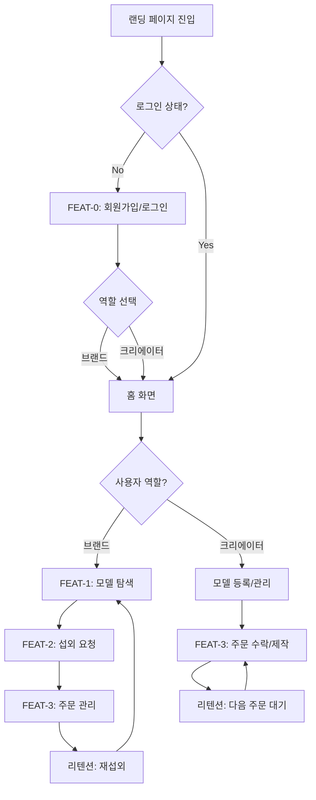
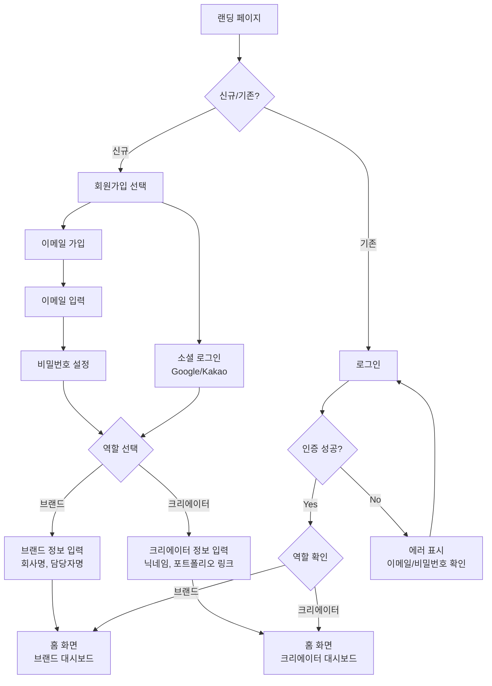
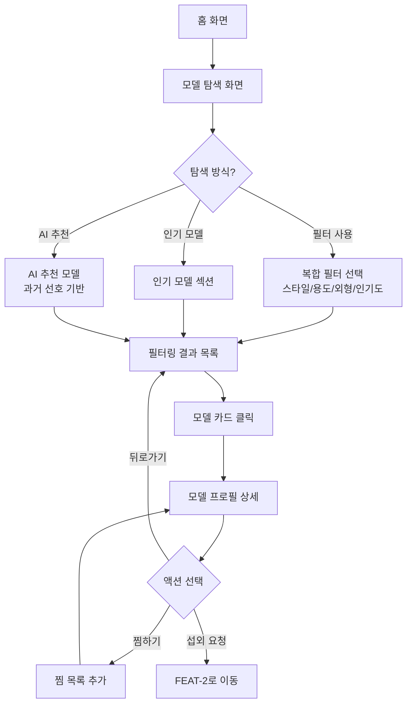
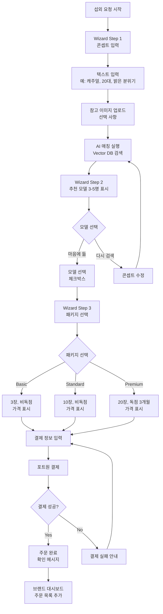
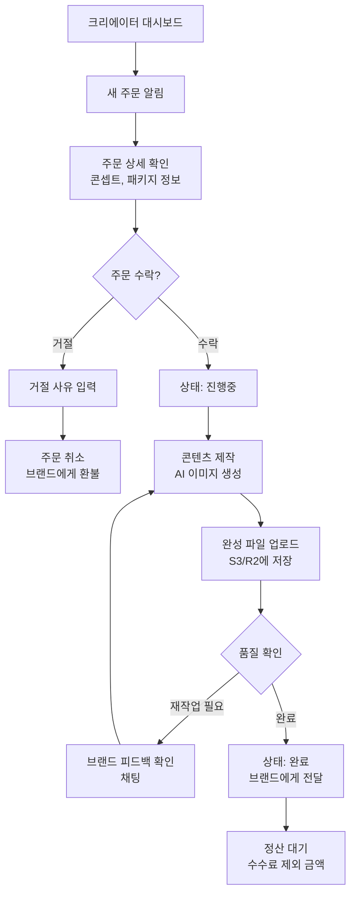
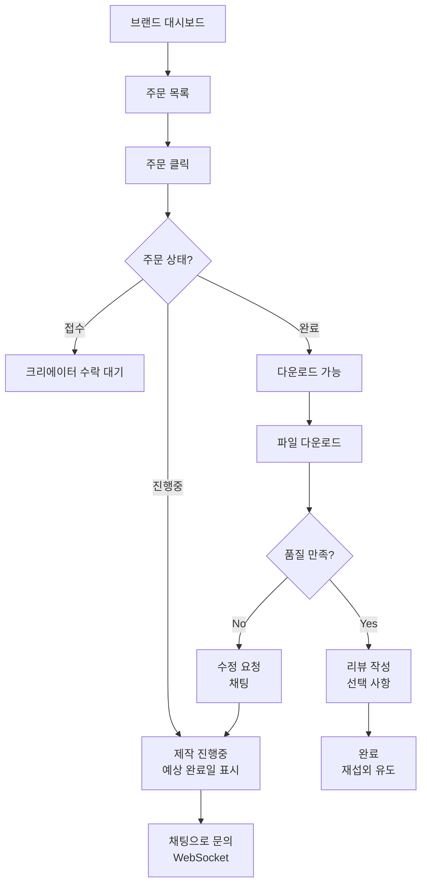
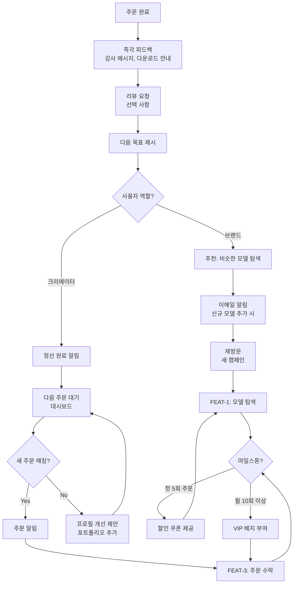
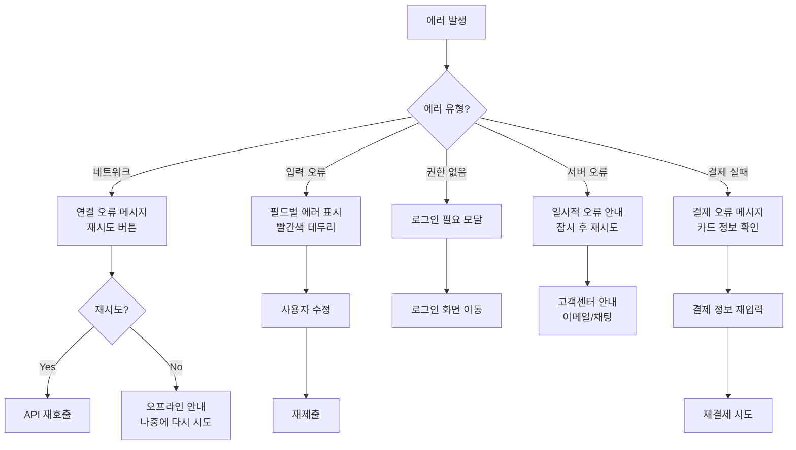

# User Flow (사용자 흐름도)

> Mermaid 플로우차트로 핵심 기능의 주요 여정을 표현합니다.
> 성공/실패 분기를 포함하고, 온보딩→핵심작업→리텐션 루프를 표현합니다.

---

## MVP 캡슐

| # | 항목 | 내용 |
|---|------|------|
| 1 | 목표 | AI 인플루언서(패션 모델/아이돌) 섭외 마켓플레이스 |
| 2 | 페르소나 | 브랜드 마케팅 담당자 (1차), AI 모델 크리에이터 (2차) |
| 3 | 핵심 기능 | FEAT-1: AI 모델 탐색/검색, FEAT-2: 섭외 요청/AI 자동 매칭, FEAT-3: 콘텐츠 제작/전달 |
| 4 | 성공 지표 (노스스타) | 월간 성사된 섭외 건수 |
| 5 | 입력 지표 | 등록된 AI 모델 수, 활성 브랜드 수 |
| 6 | 비기능 요구 | 이미지 로딩 2초 이내, 채팅 메시지 실시간 전달 |
| 7 | Out-of-scope | SNS 자동 포스팅, 실시간 영상 생성, 모바일 앱 (웹 우선) |
| 8 | Top 리스크 | AI 매칭 품질이 기대에 못 미칠 수 있음 |
| 9 | 완화/실험 | 초기에 인기 모델 수동 큐레이션 + AI 매칭 AB 테스트 |
| 10 | 다음 단계 | 화면 상세 명세 (/screen-spec) |

---

## 1. 전체 사용자 여정 (Overview)

---

## 2. FEAT-0: 온보딩/로그인 플로우

---

## 3. FEAT-1: AI 모델 탐색/검색 플로우 (브랜드)

---

## 4. FEAT-2: 섭외 요청/AI 자동 매칭 플로우 (브랜드)

---

## 5. FEAT-3: 콘텐츠 제작/전달 플로우

### 5.1 크리에이터 플로우

### 5.2 브랜드 플로우

---

## 6. 리텐션 루프 (습관 형성)

---

## 7. 에러 처리 플로우

---

## 8. 화면 목록 (Screen Inventory)

| 화면 ID | 화면명 | FEAT | 진입점 | 주요 액션 |
|---------|--------|------|--------|----------|
| S-01 | 랜딩/홈 화면 | - | URL 직접 접속 | 인기 모델 조회, 가입/로그인 |
| S-02 | 로그인 | FEAT-0 | S-01, 인증 필요 시 | 이메일/소셜 로그인 |
| S-03 | 회원가입 | FEAT-0 | S-01 | 역할 선택, 정보 입력 |
| S-04 | 모델 탐색 | FEAT-1 | S-01, 네비게이션 | 필터 적용, 모델 검색 |
| S-05 | 모델 프로필 상세 | FEAT-1 | S-04 | 포트폴리오 조회, 찜, 섭외 요청 |
| S-06 | 섭외 Wizard | FEAT-2 | S-05 | 콘셉트 입력, AI 추천, 결제 |
| S-07 | 브랜드 대시보드 | FEAT-3 | 로그인 후 자동 | 주문 관리, 다운로드 |
| S-08 | 크리에이터 대시보드 | FEAT-3 | 로그인 후 자동 | 주문 수락, 콘텐츠 업로드 |
| S-09 | AI 모델 등록 | FEAT-3 | S-08 | 이미지 업로드, AI 태그 생성 |
| S-10 | 주문별 채팅방 | FEAT-3 | S-07, S-08 | 실시간 메시지, 파일 공유 |

---

## Decision Log 참조

- DL-UX001: 섭외 요청을 3단계 Wizard로 단순화 (콘셉트→추천→결제) (2026-02-05)
- DL-UX002: 브랜드/크리에이터 별도 대시보드 제공 (역할 기반 UX) (2026-02-05)
- DL-UX003: AI 추천 실패 시 수동 필터 검색으로 대체 가능하도록 설계 (2026-02-05)
