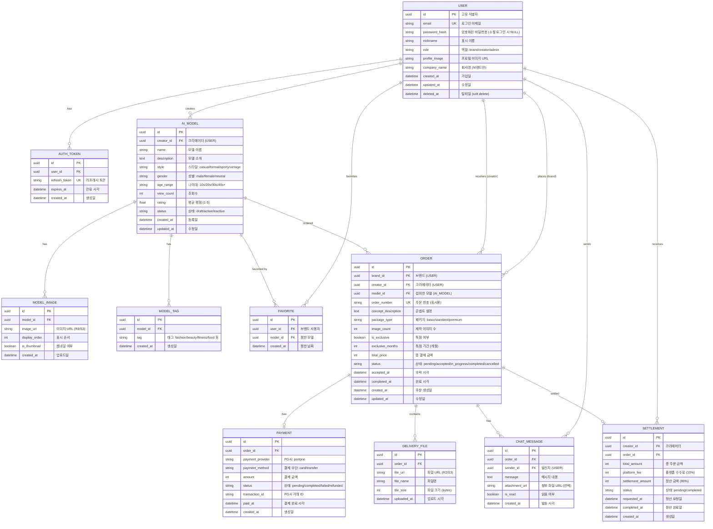
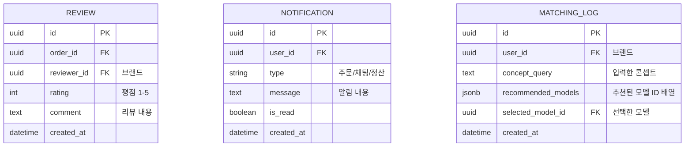

# Database Design (데이터베이스 설계)

> Mermaid ERD로 주요 엔티티와 관계를 표현합니다.
> 각 엔티티에 FEAT 주석을 달아 어떤 기능에서 사용되는지 명시합니다.
> 최소 수집 원칙을 반영하여 불필요한 개인정보는 지양합니다.

---

## MVP 캡슐

| # | 항목 | 내용 |
|---|------|------|
| 1 | 목표 | AI 인플루언서(패션 모델/아이돌) 섭외 마켓플레이스 |
| 2 | 페르소나 | 브랜드 마케팅 담당자 (1차), AI 모델 크리에이터 (2차) |
| 3 | 핵심 기능 | FEAT-1: AI 모델 탐색/검색, FEAT-2: 섭외 요청/AI 자동 매칭, FEAT-3: 콘텐츠 제작/전달 |
| 4 | 성공 지표 (노스스타) | 월간 성사된 섭외 건수 |
| 5 | 입력 지표 | 등록된 AI 모델 수, 활성 브랜드 수 |
| 6 | 비기능 요구 | 이미지 로딩 2초 이내, 채팅 메시지 실시간 전달 |
| 7 | Out-of-scope | SNS 자동 포스팅, 실시간 영상 생성, 모바일 앱 (웹 우선) |
| 8 | Top 리스크 | AI 매칭 품질이 기대에 못 미칠 수 있음 |
| 9 | 완화/실험 | 초기에 인기 모델 수동 큐레이션 + AI 매칭 AB 테스트 |
| 10 | 다음 단계 | 화면 상세 명세 (/screen-spec) |

---

## 1. ERD (Entity Relationship Diagram)

---

## 2. 엔티티 상세 정의

### 2.1 USER (사용자) - FEAT-0

| 컬럼 | 타입 | 제약조건 | 설명 |
|------|------|----------|------|
| id | UUID | PK | 고유 식별자 |
| email | VARCHAR(255) | UNIQUE, NOT NULL | 로그인 이메일 |
| password_hash | VARCHAR(255) | NULL 허용 | 소셜 로그인 시 NULL |
| nickname | VARCHAR(50) | NOT NULL | 표시 이름 |
| role | VARCHAR(20) | NOT NULL | brand/creator/admin |
| profile_image | VARCHAR(500) | NULL | 프로필 이미지 URL |
| company_name | VARCHAR(100) | NULL | 브랜드만 입력 |
| created_at | TIMESTAMP | NOT NULL, DEFAULT NOW() | 가입일 |
| updated_at | TIMESTAMP | NOT NULL | 최종 수정일 |
| deleted_at | TIMESTAMP | NULL | Soft delete용 |

**인덱스:**
- `idx_user_email` ON email
- `idx_user_role` ON role

**최소 수집 원칙 적용:**
- 필수: email, nickname, role
- 선택: profile_image, company_name
- 수집 안 함: 전화번호, 주소, 생년월일 (필요 없음)

### 2.2 AI_MODEL (AI 모델) - FEAT-1

| 컬럼 | 타입 | 제약조건 | 설명 |
|------|------|----------|------|
| id | UUID | PK | 고유 식별자 |
| creator_id | UUID | FK → USER.id, NOT NULL | 크리에이터 |
| name | VARCHAR(100) | NOT NULL | 모델 이름 |
| description | TEXT | NULL | 모델 소개 |
| style | VARCHAR(50) | NOT NULL | casual/formal/sporty/vintage |
| gender | VARCHAR(20) | NOT NULL | male/female/neutral |
| age_range | VARCHAR(10) | NOT NULL | 10s/20s/30s/40s+ |
| view_count | INTEGER | DEFAULT 0 | 조회수 |
| rating | DECIMAL(2,1) | DEFAULT 0.0 | 평균 평점 (1.0-5.0) |
| status | VARCHAR(20) | DEFAULT 'draft' | draft/active/inactive |
| created_at | TIMESTAMP | NOT NULL, DEFAULT NOW() | 등록일 |
| updated_at | TIMESTAMP | NOT NULL | 수정일 |

**인덱스:**
- `idx_model_creator_id` ON creator_id
- `idx_model_status` ON status
- `idx_model_style` ON style
- `idx_model_rating` ON rating DESC
- `idx_model_created_at` ON created_at DESC

### 2.3 ORDER (섭외 주문) - FEAT-2

| 컬럼 | 타입 | 제약조건 | 설명 |
|------|------|----------|------|
| id | UUID | PK | 고유 식별자 |
| brand_id | UUID | FK → USER.id, NOT NULL | 브랜드 사용자 |
| creator_id | UUID | FK → USER.id, NOT NULL | 크리에이터 |
| model_id | UUID | FK → AI_MODEL.id, NOT NULL | 섭외한 모델 |
| order_number | VARCHAR(50) | UNIQUE, NOT NULL | 주문 번호 (ORD-20260205-001) |
| concept_description | TEXT | NOT NULL | 콘셉트 설명 |
| package_type | VARCHAR(20) | NOT NULL | basic/standard/premium |
| image_count | INTEGER | NOT NULL | 제작 이미지 수 (3/10/20) |
| is_exclusive | BOOLEAN | DEFAULT FALSE | 독점 여부 |
| exclusive_months | INTEGER | NULL | 독점 기간 (Premium만) |
| total_price | INTEGER | NOT NULL | 총 결제 금액 (원) |
| status | VARCHAR(30) | DEFAULT 'pending' | pending/accepted/in_progress/completed/cancelled |
| accepted_at | TIMESTAMP | NULL | 수락 시각 |
| completed_at | TIMESTAMP | NULL | 완료 시각 |
| created_at | TIMESTAMP | NOT NULL, DEFAULT NOW() | 주문 생성일 |
| updated_at | TIMESTAMP | NOT NULL | 수정일 |

**인덱스:**
- `idx_order_brand_id` ON brand_id
- `idx_order_creator_id` ON creator_id
- `idx_order_model_id` ON model_id
- `idx_order_status` ON status
- `idx_order_created_at` ON created_at DESC

### 2.4 PAYMENT (결제 정보) - FEAT-2

| 컬럼 | 타입 | 제약조건 | 설명 |
|------|------|----------|------|
| id | UUID | PK | 고유 식별자 |
| order_id | UUID | FK → ORDER.id, NOT NULL | 주문 |
| payment_provider | VARCHAR(50) | NOT NULL | portone |
| payment_method | VARCHAR(50) | NOT NULL | card/transfer |
| amount | INTEGER | NOT NULL | 결제 금액 |
| status | VARCHAR(20) | DEFAULT 'pending' | pending/completed/failed/refunded |
| transaction_id | VARCHAR(100) | NULL | PG사 거래 ID |
| paid_at | TIMESTAMP | NULL | 결제 완료 시각 |
| created_at | TIMESTAMP | NOT NULL, DEFAULT NOW() | 생성일 |

**인덱스:**
- `idx_payment_order_id` ON order_id
- `idx_payment_status` ON status

### 2.5 CHAT_MESSAGE (채팅 메시지) - FEAT-3

| 컬럼 | 타입 | 제약조건 | 설명 |
|------|------|----------|------|
| id | UUID | PK | 고유 식별자 |
| order_id | UUID | FK → ORDER.id, NOT NULL | 주문 |
| sender_id | UUID | FK → USER.id, NOT NULL | 발신자 |
| message | TEXT | NOT NULL | 메시지 내용 |
| attachment_url | VARCHAR(500) | NULL | 첨부 파일 URL |
| is_read | BOOLEAN | DEFAULT FALSE | 읽음 여부 |
| created_at | TIMESTAMP | NOT NULL, DEFAULT NOW() | 발송 시각 |

**인덱스:**
- `idx_chat_order_id` ON order_id
- `idx_chat_created_at` ON created_at DESC

---

## 3. 관계 정의

| 부모 | 자식 | 관계 | 설명 |
|------|------|------|------|
| USER | AUTH_TOKEN | 1:N | 사용자는 여러 리프레시 토큰 보유 가능 |
| USER | AI_MODEL | 1:N | 크리에이터는 여러 모델 등록 |
| USER | ORDER (brand_id) | 1:N | 브랜드는 여러 주문 생성 |
| USER | ORDER (creator_id) | 1:N | 크리에이터는 여러 주문 수신 |
| USER | FAVORITE | 1:N | 브랜드는 여러 모델 찜 |
| USER | CHAT_MESSAGE | 1:N | 사용자는 여러 메시지 발송 |
| USER | SETTLEMENT | 1:N | 크리에이터는 여러 정산 수령 |
| AI_MODEL | MODEL_IMAGE | 1:N | 모델은 여러 포트폴리오 이미지 보유 |
| AI_MODEL | MODEL_TAG | 1:N | 모델은 여러 태그 보유 |
| AI_MODEL | FAVORITE | 1:N | 모델은 여러 브랜드에게 찜됨 |
| AI_MODEL | ORDER | 1:N | 모델은 여러 주문에 사용됨 |
| ORDER | PAYMENT | 1:1 | 주문은 하나의 결제 정보 보유 |
| ORDER | DELIVERY_FILE | 1:N | 주문은 여러 납품 파일 포함 |
| ORDER | CHAT_MESSAGE | 1:N | 주문은 여러 채팅 메시지 포함 |
| ORDER | SETTLEMENT | 1:1 | 주문은 하나의 정산 정보 보유 |

---

## 4. 데이터 생명주기

| 엔티티 | 생성 시점 | 보존 기간 | 삭제/익명화 |
|--------|----------|----------|------------|
| USER | 회원가입 | 탈퇴 후 30일 | Hard delete (개인정보 완전 삭제) |
| AUTH_TOKEN | 로그인 | 만료 시 | Hard delete (배치 작업) |
| AI_MODEL | 모델 등록 | 계정 탈퇴 시 | Soft delete (deleted_at 설정) |
| ORDER | 섭외 요청 | 영구 (통계용) | 사용자 ID 익명화 |
| PAYMENT | 결제 완료 | 영구 (법적 보관 의무) | 사용자 ID 익명화 |
| DELIVERY_FILE | 콘텐츠 업로드 | 주문 완료 후 1년 | Hard delete (R2에서 제거) |
| CHAT_MESSAGE | 메시지 발송 | 주문 완료 후 1년 | Hard delete |
| SETTLEMENT | 정산 요청 | 영구 (법적 보관 의무) | 사용자 ID 익명화 |

---

## 5. 확장 고려사항

### 5.1 v2에서 추가 예정 엔티티

### 5.2 인덱스 전략

- **읽기 최적화**: 자주 조회되는 컬럼에 인덱스 (status, created_at, rating)
- **쓰기 고려**: 인덱스 과다 방지 (최대 5개/테이블)
- **복합 인덱스**: (model_id, status), (brand_id, created_at) 등 자주 함께 조회되는 컬럼 조합

### 5.3 파티셔닝 계획 (v2)

- **ORDER 테이블**: created_at 기준 월별 파티셔닝 (데이터 증가 시)
- **CHAT_MESSAGE 테이블**: created_at 기준 월별 파티셔닝

---

## Decision Log 참조

- DL-DB001: PostgreSQL JSONB 활용 (MODEL 메타데이터 유연성) (2026-02-05)
- DL-DB002: Soft delete 적용 (USER, AI_MODEL 복구 가능성 확보) (2026-02-05)
- DL-DB003: ORDER 상태 기계 설계 (pending → accepted → in_progress → completed) (2026-02-05)
- DL-DB004: SETTLEMENT 테이블 분리 (정산 로직 독립성, 법적 보관) (2026-02-05)
