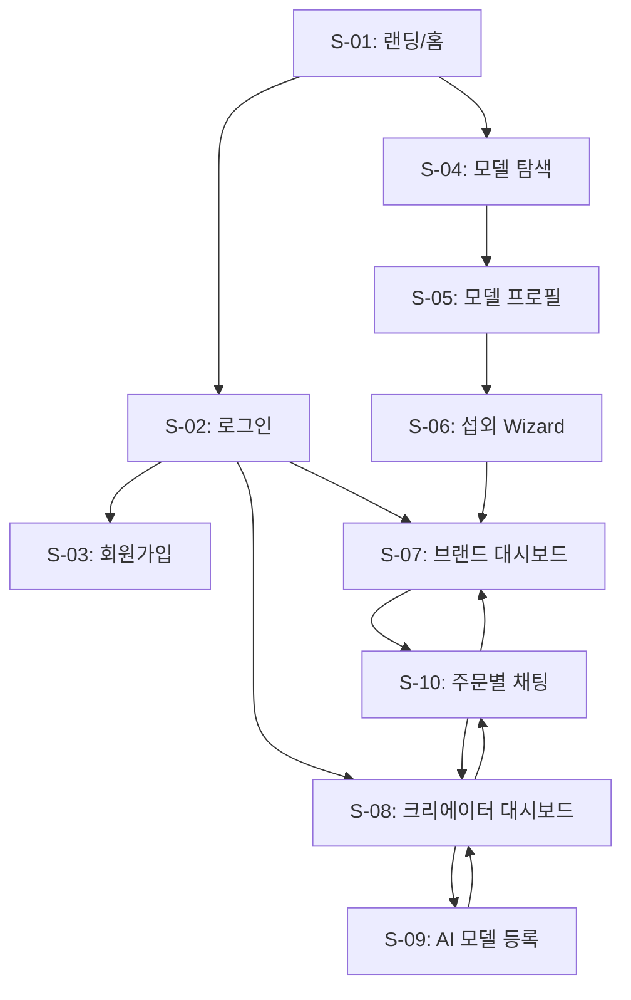

# 화면 명세

> 소크라테스 Phase 2 완료 후 생성되는 문서입니다.
> /screen-spec 스킬의 입력으로 사용됩니다.

---

## 개요

| 항목 | 내용 |
|------|------|
| **서비스명** | AI 모델 마켓플레이스 |
| **핵심 기능** | FEAT-1: AI 모델 탐색/검색, FEAT-2: 섭외 요청/AI 자동 매칭, FEAT-3: 콘텐츠 제작/전달 |
| **총 화면 수** | 10개 |
| **인증 필요 화면** | 6개 |

---

## 화면 목록

### 1. 랜딩/홈 화면 (/)

| 항목 | 내용 |
|------|------|
| **화면 ID** | S-01 |
| **연결 기능** | FEAT-0, FEAT-1 |
| **인증 필요** | No |
| **진입점** | URL 직접 접속, 검색 엔진 |

**주요 요소:**
- 히어로 섹션: 메인 카피 + CTA 버튼 ("AI 모델 찾기", "모델 등록하기")
- 인기 모델 섹션: 조회수 기준 상위 8개 모델 그리드
- 추천 모델 섹션: AI 추천 (로그인 시) 또는 최신 등록 모델 (비로그인)
- 통계 섹션: 등록된 모델 수, 성사된 섭외 건수
- 푸터: 회사 정보, 이용약관, 개인정보처리방침

**사용자 액션:**
- "AI 모델 찾기" 클릭 → S-04 (모델 탐색)
- "모델 등록하기" 클릭 → S-02 (로그인) 또는 S-09 (등록)
- 모델 카드 클릭 → S-05 (모델 프로필)
- "로그인" 클릭 → S-02

**이동 가능 화면:**
- → S-02 로그인 (비로그인 시 CTA 클릭)
- → S-04 모델 탐색
- → S-05 모델 프로필

---

### 2. 로그인 (/auth/login)

| 항목 | 내용 |
|------|------|
| **화면 ID** | S-02 |
| **연결 기능** | FEAT-0 |
| **인증 필요** | No |
| **진입점** | S-01, 인증 필요 페이지 접근 시 자동 리다이렉트 |

**주요 요소:**
- 이메일 입력 필드
- 비밀번호 입력 필드
- "로그인" 버튼 (Primary Large)
- 소셜 로그인 버튼 (Google, Kakao)
- "회원가입" 링크

**사용자 액션:**
- 이메일/비밀번호 입력 후 로그인 → 역할에 따라 S-07 또는 S-08
- 소셜 로그인 → 최초 로그인 시 S-03 (역할 선택), 기존 회원은 대시보드
- "회원가입" 클릭 → S-03

**이동 가능 화면:**
- → S-03 회원가입
- → S-07 브랜드 대시보드 (브랜드 로그인)
- → S-08 크리에이터 대시보드 (크리에이터 로그인)

---

### 3. 회원가입 (/auth/signup)

| 항목 | 내용 |
|------|------|
| **화면 ID** | S-03 |
| **연결 기능** | FEAT-0 |
| **인증 필요** | No |
| **진입점** | S-02, S-01 |

**주요 요소:**
- 역할 선택 (브랜드 / 크리에이터)
- 이메일 입력 필드
- 비밀번호 입력 필드 (8자 이상, 영문+숫자)
- 닉네임 입력 필드
- 회사명 입력 필드 (브랜드만 표시)
- 이용약관 동의 체크박스
- "가입하기" 버튼

**사용자 액션:**
- 역할 선택 → 브랜드 선택 시 회사명 필드 표시
- "가입하기" 클릭 → 검증 통과 시 S-07 또는 S-08
- 이미 계정 있음 → S-02

**이동 가능 화면:**
- → S-02 로그인
- → S-07 브랜드 대시보드 (브랜드 가입)
- → S-08 크리에이터 대시보드 (크리에이터 가입)

---

### 4. 모델 탐색 화면 (/explore)

| 항목 | 내용 |
|------|------|
| **화면 ID** | S-04 |
| **연결 기능** | FEAT-1 |
| **인증 필요** | No |
| **진입점** | S-01, 네비게이션, S-05 뒤로가기 |

**주요 요소:**
- 검색 바 (키워드 검색)
- 복합 필터 사이드바:
  - 스타일: casual/formal/sporty/vintage (다중 선택)
  - 성별: male/female/neutral
  - 나이대: 10s/20s/30s/40s+
  - 정렬: 인기순/최신순/평점순
- 모델 카드 그리드 (3-4열)
- 페이지네이션

**사용자 액션:**
- 필터 적용 → 목록 자동 업데이트
- 모델 카드 클릭 → S-05 (모델 프로필)
- 찜하기 아이콘 클릭 → 로그인 필요 시 S-02

**이동 가능 화면:**
- → S-05 모델 프로필
- → S-02 로그인 (찜하기 시 비로그인)

---

### 5. 모델 프로필 상세 (/models/:id)

| 항목 | 내용 |
|------|------|
| **화면 ID** | S-05 |
| **연결 기능** | FEAT-1 |
| **인증 필요** | No (조회만), Yes (찜/섭외) |
| **진입점** | S-01, S-04 |

**주요 요소:**
- 모델 썸네일 이미지 (3:4 비율)
- 모델 이름, 스타일, 성별, 나이대
- 조회수, 평균 평점
- 크리에이터 정보 (닉네임, 프로필 이미지)
- 포트폴리오 이미지 갤러리 (그리드)
- 모델 소개 (description)
- CTA 버튼: "섭외 요청하기" (Primary), "찜하기" (Secondary)

**사용자 액션:**
- "섭외 요청하기" 클릭 → S-06 (섭외 Wizard)
- "찜하기" 클릭 → 찜 목록 추가 (로그인 필요)
- 포트폴리오 이미지 클릭 → 라이트박스 확대

**이동 가능 화면:**
- → S-06 섭외 Wizard (브랜드만)
- → S-02 로그인 (비로그인 시 CTA 클릭)
- → S-04 뒤로가기 (탐색 화면)

---

### 6. 섭외 Wizard (/booking/new)

| 항목 | 내용 |
|------|------|
| **화면 ID** | S-06 |
| **연결 기능** | FEAT-2 |
| **인증 필요** | Yes (브랜드만) |
| **진입점** | S-05 (모델 프로필) |

**주요 요소:**

**Step 1: 콘셉트 입력**
- 텍스트 영역 (콘셉트 설명 500자)
- 참고 이미지 업로드 (선택, 최대 3장)
- "다음" 버튼

**Step 2: AI 추천 모델**
- AI 추천 모델 3-5개 카드
- 각 카드: 썸네일, 이름, 매칭 점수
- 라디오 버튼으로 1개 선택
- "이전", "다음" 버튼

**Step 3: 패키지 선택 및 결제**
- 패키지 옵션 (라디오 버튼):
  - Basic: 3장, 비독점, 가격 표시
  - Standard: 10장, 비독점, 가격 표시
  - Premium: 20장, 독점 3개월, 가격 표시
- 총 금액 표시
- 결제 정보 입력 (포트원 연동)
- "결제하기" 버튼

**사용자 액션:**
- Step 1 → 콘셉트 입력 후 "다음" → AI 매칭 실행
- Step 2 → 모델 선택 후 "다음"
- Step 3 → 패키지 선택, 결제 → S-07 (주문 완료 메시지)

**이동 가능 화면:**
- → S-07 브랜드 대시보드 (결제 완료 후)
- → S-05 모델 프로필 (취소 시)

---

### 7. 브랜드 대시보드 (/dashboard/brand)

| 항목 | 내용 |
|------|------|
| **화면 ID** | S-07 |
| **연결 기능** | FEAT-3 |
| **인증 필요** | Yes (브랜드만) |
| **진입점** | 로그인 후 자동, S-06 결제 완료 |

**주요 요소:**
- 네비게이션: 주문 관리, 찜 목록, 프로필 설정
- 주문 목록 테이블:
  - 주문 번호, 모델 이름, 패키지, 상태, 금액, 주문일
  - 상태 배지 (접수/진행중/완료/취소)
- 주문 상세 버튼 → 모달 또는 S-10 (채팅)

**사용자 액션:**
- 주문 클릭 → 주문 상세 모달 (상태, 예상 완료일)
- "채팅" 클릭 → S-10 (주문별 채팅)
- "다운로드" 클릭 (완료 시) → 파일 다운로드
- "모델 탐색" 버튼 → S-04

**이동 가능 화면:**
- → S-10 주문별 채팅
- → S-04 모델 탐색
- → S-05 모델 프로필 (주문 내 모델 클릭)

---

### 8. 크리에이터 대시보드 (/dashboard/creator)

| 항목 | 내용 |
|------|------|
| **화면 ID** | S-08 |
| **연결 기능** | FEAT-3 |
| **인증 필요** | Yes (크리에이터만) |
| **진입점** | 로그인 후 자동 |

**주요 요소:**
- 네비게이션: 주문 관리, 내 모델, 정산, 프로필 설정
- 새 주문 알림 배지
- 주문 목록 테이블:
  - 주문 번호, 브랜드명, 모델 이름, 패키지, 상태, 금액, 주문일
  - 액션 버튼: "수락", "거절", "완료", "채팅"
- 정산 대기 금액 표시

**사용자 액션:**
- "수락" 클릭 → 상태: 진행중
- "거절" 클릭 → 거절 사유 입력 모달
- "완료" 클릭 → S-10 (파일 업로드 후 완료)
- "채팅" 클릭 → S-10 (주문별 채팅)
- "내 모델" 탭 → 등록된 모델 목록, "모델 등록" → S-09

**이동 가능 화면:**
- → S-09 AI 모델 등록
- → S-10 주문별 채팅

---

### 9. AI 모델 등록 (/models/new)

| 항목 | 내용 |
|------|------|
| **화면 ID** | S-09 |
| **연결 기능** | FEAT-3 |
| **인증 필요** | Yes (크리에이터만) |
| **진입점** | S-08 (크리에이터 대시보드) |

**주요 요소:**
- 모델 이름 입력 필드
- 포트폴리오 이미지 업로드 (드래그 앤 드롭, 최대 10장)
- AI 자동 생성 버튼:
  - 스타일 자동 감지
  - 태그 자동 생성
  - 소개 문구 AI 작성
- 수동 수정 가능 필드:
  - 스타일 (드롭다운)
  - 성별, 나이대 (드롭다운)
  - 소개 (텍스트 영역)
- "공개" 버튼, "임시 저장" 버튼

**사용자 액션:**
- 이미지 업로드 → AI 분석 실행 (로딩 표시)
- AI 자동 생성 결과 확인 → 수정 가능
- "공개" 클릭 → S-08 (모델 목록에 추가)
- "임시 저장" 클릭 → 상태: draft

**이동 가능 화면:**
- → S-08 크리에이터 대시보드 (공개 완료)
- → S-05 모델 프로필 (미리보기)

---

### 10. 주문별 채팅방 (/orders/:id/chat)

| 항목 | 내용 |
|------|------|
| **화면 ID** | S-10 |
| **연결 기능** | FEAT-3 |
| **인증 필요** | Yes (주문 당사자만) |
| **진입점** | S-07, S-08 |

**주요 요소:**
- 상단: 주문 정보 요약 (주문 번호, 모델 이름, 상태)
- 채팅 메시지 목록 (시간순)
  - 발신자 이름, 프로필 이미지
  - 메시지 내용
  - 첨부 파일 (이미지, PDF)
  - 시간
- 하단: 메시지 입력창
  - 텍스트 입력 필드
  - 파일 첨부 버튼
  - "전송" 버튼

**사용자 액션:**
- 메시지 입력 후 전송 → WebSocket으로 실시간 전달
- 파일 첨부 → 이미지/문서 업로드
- 첨부 파일 클릭 → 다운로드 또는 미리보기

**이동 가능 화면:**
- → S-07 브랜드 대시보드 (뒤로가기)
- → S-08 크리에이터 대시보드 (뒤로가기)

---

## 화면 흐름도



---

## 화면 연결 매트릭스

| From \ To | 홈 | 로그인 | 회원가입 | 탐색 | 프로필 | Wizard | 브랜드 | 크리 | 등록 | 채팅 |
|-----------|-----|--------|---------|------|--------|--------|--------|------|------|------|
| **홈 (S-01)** | - | ✓ | ✓ | ✓ | ✓ | | | | | |
| **로그인 (S-02)** | ✓ | - | ✓ | | | | ✓ | ✓ | | |
| **회원가입 (S-03)** | | ✓ | - | | | | ✓ | ✓ | | |
| **탐색 (S-04)** | ✓ | ✓ | | - | ✓ | | | | | |
| **프로필 (S-05)** | | ✓ | | ✓ | - | ✓ | | | | |
| **Wizard (S-06)** | | | | | ✓ | - | ✓ | | | |
| **브랜드 (S-07)** | ✓ | | | ✓ | ✓ | | - | | | ✓ |
| **크리 (S-08)** | ✓ | | | | | | | - | ✓ | ✓ |
| **등록 (S-09)** | | | | | ✓ | | | ✓ | - | |
| **채팅 (S-10)** | | | | | | | ✓ | ✓ | | - |

---

## 공통 요소

### 헤더 (Header)
- 로고 (좌측 상단) → S-01 (홈)
- 네비게이션 메뉴:
  - "모델 탐색" → S-04
  - "모델 등록" → S-09 (크리에이터) / S-02 (비로그인)
- 사용자 메뉴 (우측):
  - 비로그인: "로그인", "회원가입"
  - 로그인: 프로필 이미지 드롭다운 (대시보드, 로그아웃)

### 푸터 (Footer)
- 회사 정보
- 이용약관, 개인정보처리방침
- 고객센터 이메일

---

## 인증 흐름

| 화면 | 비로그인 시 |
|------|------------|
| S-01 홈 | 접근 가능, 일부 기능 제한 (찜하기, 섭외 요청) |
| S-04 탐색 | 접근 가능, 조회만 |
| S-05 프로필 | 접근 가능, CTA 클릭 시 로그인 모달 |
| S-06 Wizard | 로그인 필요 (S-02로 리다이렉트) |
| S-07 브랜드 | 로그인 필요 (S-02로 리다이렉트) |
| S-08 크리에이터 | 로그인 필요 (S-02로 리다이렉트) |
| S-09 모델 등록 | 로그인 필요 (S-02로 리다이렉트) |
| S-10 채팅 | 로그인 필요 (S-02로 리다이렉트) |

---

## 빈 상태 (Empty States)

| 화면 | 빈 상태 메시지 | CTA |
|------|---------------|-----|
| S-07 주문 목록 (브랜드) | "아직 주문 내역이 없습니다" | "AI 모델 찾아보기" → S-04 |
| S-08 주문 목록 (크리에이터) | "새로운 주문이 들어오면 알려드릴게요" | "내 모델 등록하기" → S-09 |
| S-08 내 모델 | "등록된 모델이 없습니다" | "첫 번째 모델 등록하기" → S-09 |
| S-04 검색 결과 | "검색 결과가 없습니다" | "필터 초기화" |
| S-10 채팅 | "아직 메시지가 없습니다" | - |

---

## 에러 상태

| 에러 유형 | 표시 방식 | 사용자 액션 |
|----------|----------|------------|
| 네트워크 오류 | 토스트 (빨강) + 재시도 버튼 | "재시도" |
| 입력 오류 | 필드 아래 에러 메시지 (빨간 텍스트) | 수정 후 재제출 |
| 권한 오류 | 모달 "로그인이 필요합니다" | "로그인" → S-02 |
| 서버 오류 | 전체 화면 에러 페이지 | "홈으로" → S-01 / "재시도" |
| 결제 실패 | 모달 "결제 실패" + 사유 | "다시 시도" / "취소" |

---

## 반응형 브레이크포인트

| 디바이스 | 너비 | 주요 변화 |
|----------|------|----------|
| 모바일 | < 768px | 1열 레이아웃, 하단 네비게이션, 풀스크린 모달 |
| 태블릿 | 768px ~ 1024px | 2열 그리드, 축소된 사이드바 |
| 데스크톱 | > 1024px | 3-4열 그리드, 고정 사이드바, 최대 너비 1280px |

---

## 다음 단계

이 문서를 기반으로:

1. **`/screen-spec`** 실행 → 각 화면별 상세 YAML 명세 생성
2. **`/tasks-generator`** 실행 → 화면 단위 태스크 생성

```
06-screens.md (이 문서)
    ↓
/screen-spec
    ↓
specs/screens/*.yaml
    ↓
/tasks-generator
    ↓
TASKS.md
```
